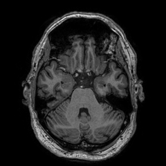
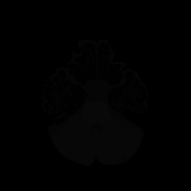
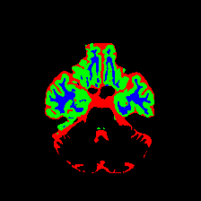
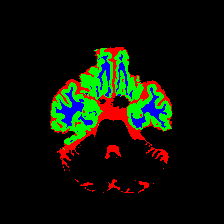

# 医学图像分割

#### 数据集
MRBrainS 数据集
1~4 用于train 5用于val
#### 实现
1. VGG-FCN 
2. UNet 参考：[pytorch-unrt](https://github.com/milesial/Pytorch-UNet)
#### predict
checkpoint中已提供训练好的model
```python
python predict.py
```
#### 结果
Mean IoU : 0.8053 Mean dice: 0.8921
1. 原图：



2. mask:



3. 预测



4. dense crf


